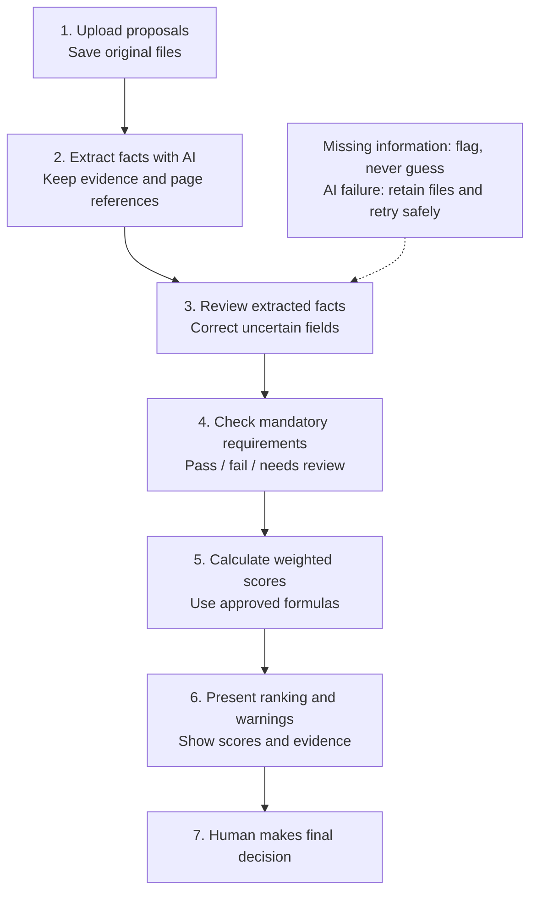

# Process Flow

```mermaid
flowchart TD
    A[1. Upload proposals<br/>Save original files] --> B[2. Extract facts with AI<br/>Keep evidence and page references]
    B --> C[3. Review extracted facts<br/>Correct uncertain fields]
    C --> D[4. Check mandatory requirements<br/>Pass / fail / needs review]
    D --> E[5. Calculate weighted scores<br/>Use approved formulas]
    E --> F[6. Present ranking and warnings<br/>Show scores and evidence]
    F --> G[7. Human makes final decision]
    H[Missing information: flag, never guess<br/>AI failure: retain files and retry safely] -.-> C
```

AI extracts facts. Deterministic rules validate and score. A human reviewer makes the final decision.
